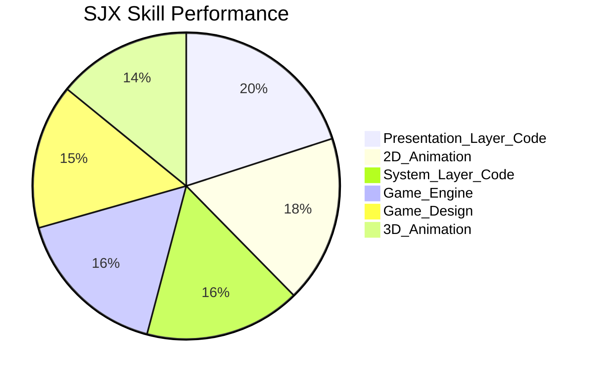
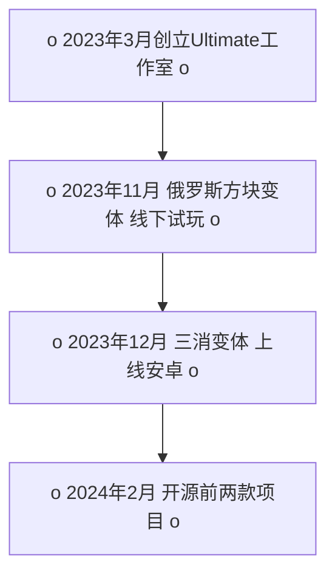

 
# You Play the Secret Agent.

<!-- 
主角：读者（特工）
对手: 我（调查对象）
目击者：旁白（线人）
关系：
特工 -> 调查对象：冷漠 断言 
线人 -> 调查对象：严格 批评 
调查对象 的 领导 -> 调查对象：接受 安心
调查对象 的 同事 -> 调查对象：信任 合作
线人 -> 特工：依附 听从
特工 -> 线人：发号施令
评分标准：
游戏相关：10分 + 耳目一新：10分 + 有价值：10分
-->

## 个人特征
<center>线人 喘着粗气，看起来像一路小跑过来的，对你说道：<br></center>
“<br>
Boss您好，我是您的 线人，为了完成这次对目标 SJX 的调查，我潜入他家拍的照片：”<br>


“<br>
基本都是和游戏相关的书籍和杂志，从制作到设计都有。<br>
有一大部分是关于 人类学 设计学 心理学。<br>
其他还有20多个领域的书籍，都是和游戏学相关的。<br><br>

我怀疑他真有时间看完这些书吗？真是不自量力<br>
我观察这家伙好几天了，几乎形影不离。<br>
噢对了，他最近好像在自学音乐，买了一些关于音乐的书籍。<br><br>
这家伙常常一个人，看着像在思考些什么，有时候会突然笑出声来，绝对是个怪人。<br>
他常带在身边的是这两本书： 游戏设计艺术 和 rule of play，都快被他翻烂了。”<br><br>
<!-- 疑问 -->

---

<center>线人 看你没什么反应，又说道：<br></center>
“<br>
所以你怎么看？你真觉得这家伙能对咱们派上用场吗？”<br>
<center>你用眼神示意 线人 继续往下说。<br></center><br>

---

## 教育背景

<center>线人从他的公文包里拿出一叠文件，递给你，说道：<br></center>
“<br>
他的本科是在英国的 University of Central Lancashire 读的，专业是动画。<br>才二等学位。<br>作为一个中国人远渡重洋，真是浪费钱啊。”<br>
<br><br>
“<br>
我潜入他之前的居所，发现了一些其他和他教育背景相关的东西。<br>
他家里放了一堆看着很幼稚的画，画堆上是一些获奖证书 和 艺术班的初高中毕业证书。<br>
我怕会有遗漏你觉得有用的信息，所以都拍了下来：”<br>
<br><br>
<center>你一脸不耐烦的说道：<br></center>
“<br>
这么古早的信息就别拿出来了。”<br>
<center>线人 一边挠头 一边附和的整理着文件把一些文件放回公文包，又在公文包里翻找一番后放上了桌面，说道：<br></center>
“<br>
10年前，他在中国的一所叫“Jiangnan University”的中国大学里学习了3年。
专业是数字媒体艺术。<br>
这所学校，是中国政府为了面向21世纪，迎接世界新技术革命的挑战而建立的。<br>
他当时的毕业课题就是独立游戏，10年过去了，到现在还没一款成名作品，真是可笑。”<br>
<br><br>

<center>线人 看你浏览的差不多了，便打开电脑一番操作后，将电脑放在桌上并转向你，说道：<br></center>
“<br>
工作之后他还自学了一些C++编程相关的课程。<br>
这是我在浏览他网上个人资料时找到的。<br>
还有一些类似的网络课程，需要向您展示吗？”<br>
<br><br>

<center>你看着桌上的网课文件，摸着下巴心想，看起来他还挺努力，并摇摇手，示意他赶紧结束“教育背景”这部分的介绍。<br></center>
<center>线人 仔细翻找公文包，并反复甄别和挑选，掏出“教育背景”部分最后一份文件，说道：<br></center>
“<br>
他在英国Kinston拿了硕士学位，是游戏设计专业，<br>
估计这也就是他最能拿得出手的文凭了。”<br>
<br><br>

## 项目愿景：
<center>线人 清了清嗓子，摆出了一副领导的姿态说道：<br></center>
“<br>
SJX1994 曾和我说过‘游戏学’是这个时代可以把思想具象化的最好的方式。<br>
他要一生致力于创造出可以流传千年的思想。<br>
我认可他对游戏的热情。”<br>
<center>你分明觉得这是在说大话，线人察觉到你的不屑，立刻转变姿态，附和道：<br></center>
“<br>
明明什么拿得出手的成就都没有，真是不自量力！”<br>

## 成就和荣誉
<center>线人 忽然压低了嗓音，看起来有些胆怯的说到：<br></center>
“<br>
据他朋友所说，他获过很多奖项。<br>
但这家伙似乎很不看重名誉和地位。<br>
他曾经把获得的奖牌送给朋友换了一杯咖啡。<br>
我也确实没有在他家里找到什么奖杯/奖牌之类的东西。”<br>
<center>你点头示意他继续往下说。<br></center>

## 个人技能
<center>线人 邪魅一笑 脸上展现出一幅自信的表情：<br></center>
“<br>
我利用了高级技术手段 黑入他所有所做过的项目 集成 多个专业的评估工具后，分析出他最擅长的技能。60分代表了职业平均水平，这张 Pie Chart 会随动态的实时更新。”<br>
<center>线人 掏出了一个小的显示屏，上面的数字不断跳动，直到慢慢停下，显示出如下数值：<br></center>

### Pie Chart



--- 

<center>线人 看到你对他提供的情报很满意，便更加自信：<br></center>
“<br>
既然Boss远道而来，并且可以听我说那么多。<br>
我就更要拿出一些有价值的资料了。<br>
接下来的资料绝对是你会感兴趣的。”<br>

--- 

## 独立游戏项目
<center>线人 拿出一个小键盘，连接上小显示器，打开命令行，输入了一些代码，小显示器上的图案发生了变化：<br></center>

### Flow Chart



“<br>
如小显示上的 Flow Chart 所示。<br>
他目前有两款制作完成的独立游戏项目。<br>
一款是俄罗斯方块变体，另一款是三消变体。<br>
俄罗斯方块变体，尚未发布，但已经获得了一些玩家的评价。<br>
三消变体，已经发布，但是没有获得很多的关注。”<br>
<center>你的目光被 Flow Chart 旁的电脑吸引，电脑上同步显示两款游戏的画面和游戏简介：<br></center>
<br><br>

```yaml
    形式身份 : 
    "
    俄罗斯方块的即时战术变种
    "
    项目目的 : 
    "
    一次性项目
    游戏设计理论的实践
    "
    开发时间 : 
    "
    2023-6 — 2023-11
    "
    操作规则 : 
    "
    战术思考 => 点击部署 => 观察结果
    "
    隐性规则 : 
    "
    实时性、战术强调、多单位管理、环境利用
    "
    构成规则0 : 
    "
    在构筑环节,
    因为 4个方块 每个方块有4个兵种可选 可以重复,
    所以有 4 * 4 * 4 * 4 = 256 种组合
    "
    构成规则1 : 
    "
    在构筑环节,
    可以将最多4个单位部署在9宫格中 
    第一个方块有9种放置位置，第二个方块有8种放置位置，
    第三个方块有7种放置位置，第四个方块有6种放置位置。
    因此，总的摆放方法数为 9 * 8 * 7 * 6 = 3024 种。
    "
    构成规则2 :
    "
    在对战中,
    有4个方向可以旋转。
    "
    构成规则3 :
    "
    在对战中,
    有180秒的时间限制。每三秒钟会有一次新的方块出现。
    所以最多可以出现60个方块。
    "
    构成规则4 :
    "
    综上所述，
    有 256 * 3024 * 4 * 60 = 185,794,560 种排列可能性。
    "
    构成规则5 : 
    "
    玩家以一种操作 
    在 10 * 20 的离散空间内 
    以 1,472,640 种可能性进行作战 
    最终以占领格子数量 来判断胜负。
    "
    源码 : "https://github.com/SJX1994/UC_Mirror.git"
```
<center>你点击了电脑键盘上的空格键，弹出了一个视频播放窗口：<br></center>
<center>
<iframe width="560" height="315" src="https://www.youtube.com/embed/ashP4oeN3Fo?si=joBeWk63O98Q94yE" title="YouTube video player" frameborder="0" allow="accelerometer; autoplay; clipboard-write; encrypted-media; gyroscope; picture-in-picture; web-share" allowfullscreen></iframe>
</center>


## 职业经历：
- 我走访了他之前工作过的所有公司，几乎都是在中国。也在英国打过半年临工。
- 奇怪的是都是和游戏技术相关的公司。
- 而且每次在做到最如日中天的时候，就会跳槽到下一家公司，看上去他在密谋着什么。
- 但令人意外的是，每家公司都对他的评价非常高。
- 他最后离开的一家公司给他的薪水是3万块的月薪。
- 要知道这在21世纪的中国是非常高的薪水了。
- 资料我贴在下面：
- 《一堆离职证明》
- 我仔细翻看了资料，整理了一下，这些可能是你会感兴趣的：

```yaml

公司名 : "无锡炎梦网络科技有限公司"
时间 : "2022-11-7 — 2023-3-31"
地址 : "无锡市锡山区云林芙蓉西路30号"
职称 : "3A 游戏⼯作室制作⼈ 兼 南京⽅⾯负责⼈"
部门 : "游戏部门"
工作 : "主导一款 3AMMORPG游戏的设计研发工作。"

公司名 : 南京中科创达软件科技有限公司 Thunder Soft
时间：2021-6-21  —  2022-11-04
职称：Kanzi/OpenGL工程师
地址：江苏省南京市安德⻔⼤街50号怡化中⼼A座11- 楼
电话：025-83291677
部门：研发三组
工作：主导北美福特旗下2023年车机（福特、林- 肯、野马）渲染研发；制定渲染工作流程；研究应用- 图形学技术与算法

公司名 : 艾迪亚数字娱乐有限公司 ADIA DIGITAL ART 
时间：2020-10-09  —  2021-5-31
职称：游戏引擎工程师
地址：南京市⾬花区花神⼤道21号德迅科技4楼
电话：025-86330855
部门：游戏引擎工程师
工作：主导搭建公司数据库前端的渲染；制作工作流- 程中的自动化软件；完成客户需求（Konami，- Capcom，Ubisoft）

公司名 : 南京网觉软件有限公司 WebEye
时间：2019-04-02 — 2020-9-15
职称：U3D 开发工程师
地址：南京市雨花台区花神大道 86 号东软大厦 - 311 室
电话：025-86980686
部门：Vega Studio
工作：U3D 游戏编程、资产制作

```